<div align="center">


# RainyWatch · 小暴雨助手

<big>“愿虹光永驻天空，也愿有冷雨落下。”</big>

<big>“Long may rainbows adorn the sky — and let it rain cold on thee, where rain and rainbow forever agree.”</big>

**常驻桌面的 CS2 赛况小组件 — 直播比分、赛程倒计时、赛果与变阵,一瞥即知**


[](https://likeravine233.github.io/RainyWatch/)

[简体中文](#-简体中文) · [English](#-english)

<p>
  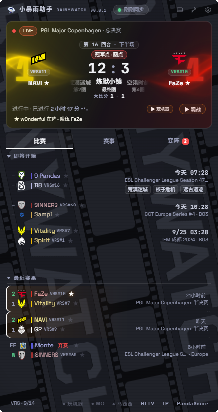
  &nbsp;
  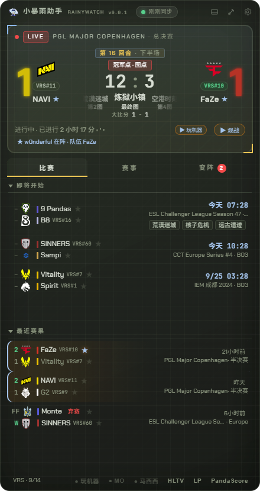
</p>

<p><sub>除标注"真实数据"的截图外,其余截图均来自内置演示数据,队伍 / 赛事 / 比分仅为示例<br>Screenshots use built-in demo data unless noted as live data — teams, events and scores are samples</sub></p>

</div>

---

## 🌧️ 简体中文

### 这是什么?

RainyWatch(小暴雨助手)是一个挂在桌面角落的 CS2 赛况悬浮窗:现在谁在打、比分多少、下一场几点、最近谁赢了、阵容有什么变动——不用切窗口,扫一眼就知道。免安装单文件,Windows 10 / 11 可用,界面提供中文 / English 双语。

### 🕹️ 主卡 · 直播中

直播中的比赛占据主卡,信息层级参照转播 HUD:

- **中央大数字 = 当前图回合比分**(如 12:9),正下方是**图序带**(图1 远古遗迹 → 图2 荒漠迷城 → 最终图 炼狱小镇,当前图着重高亮)与**大比分**(1 - 0);两侧队标外侧还有**队色特大比分数字**垫在背景里(接近主卡高、带同色辉光),一眼看清谁领先
- 顶部标签全部由数据推导(BO3/BO5 + 回合数即可算出):**手枪局 / 即将中场 / 图点 / 加时 / 赛点 / 决胜图** 等(MR12 规则)
- 每图回合变化有闪烁提示;**"进行中 · 已进行时长"实时走表**,与**关注标注(★ w0nderful 在阵 · 队伍 FaZe)分两行排版**,互不挤压截断;**点击比分一键复制**(含当前图比分与回合)
- 右下角 **"▶ 观战"**(赛事官方流)与 **"▶ 玩机器"**(玩机器Machine 斗鱼直播间 6657)一键直达
- 开赛时间变动时,比赛行会标注 **"推迟 / 提前 xx 分钟"**(改期检测)

无回合级数据时自动回退为大比分为主,不影响其它信息;图序带可在设置里切换为**只显示当前图**(设置 → 地图信息显示)。

<p align="center">
  <br>
  <sub>战术沙盘主题:中央回合比分 · 图序带 · 两侧队色背景大比分 · 队标下方 VRS 徽章</sub>
</p>

### 📋 比赛列表

- **即将开始**:比赛时刻可切换时区(默认跟随本机,夏令时自动处理),临近 1 小时自动换倒计时("00:17 后 · 今天 23:47"),日期显示格式可调
- **最近赛果**:胜负着色、回放入口、行内标注"N 小时前结束"(在场观测到的为精确值,否则以"约"估算)
- **弃赛显示**:弃赛场按数据源原样给出 **FF / W** 比分牌(W = 不战而胜的一方),弃赛队伍名旁挂「弃赛」小旗标,开赛时间与"N 小时前"照常显示
- **图序条**:Liquipedia 收录了 BP 的场次,行内直接展示整条地图顺序(远古遗迹 → 荒漠迷城 → 炼狱小镇)
- **V# 徽章**:队名旁标注 Valve 全球排名(VRS 前 200),排名更高一侧绿色高亮;主卡队标下方同样有。排名来自 **VRS(Valve 官方区域排名)**:官方约每月发布一期(临近 Major 预选会加密发布),且不含进行中的比赛;应用经 Liquipedia 跟随同步,通常滞后官方数小时到一天,每 6 小时自动核对一次,页脚显示数据标注的更新日期
- **赛事评级徽标**:S / A / B / C 级(Liquipedia tier)
- **★ 关注队伍与高光选手**:比赛行队伍名旁、变阵行选手旁的 ★ 一键关注,或设置面板搜索选手添加;命中关注的比赛**整行高亮并置顶排序**,鼠标悬停该行时向下舒展一行,露出「★ 队伍 FaZe · ropz 在阵」式关注标注;开赛前 5/10/15/30 分钟可弹系统提醒,关注的比赛结束推送赛果速报;PandaScore 与 Liquipedia 的队名差异(全名 vs 缩写)会自动对齐,NAVI 这类短写队伍也不会漏置顶
- 列表分区(即将开始/最近赛果)可独立折叠,小窗口也能同屏看两个区块

<p align="center">
  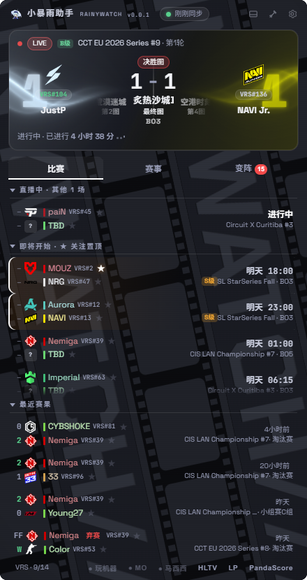<br>
  <sub>队色对撞主题 · 真实数据截图:弃赛行 FF / W 与「弃赛」旗标 · 即将开始倒计时与"N 小时前"赛果 · V# 徽章</sub>
</p>

### 🏆 赛事

进行中 / 即将开始的赛事列表,按 **S / A / B / C 级**评级标注,赛事图标、日期区间自动翻译为中文("8月20日 – 9月12日")。赛事名支持**简称 / 全称 / 中文惯称**三种模式(IEM 科隆、裂变天地…基于国内平台通用译名,无惯用译名的保留原文)。

<p align="center">
  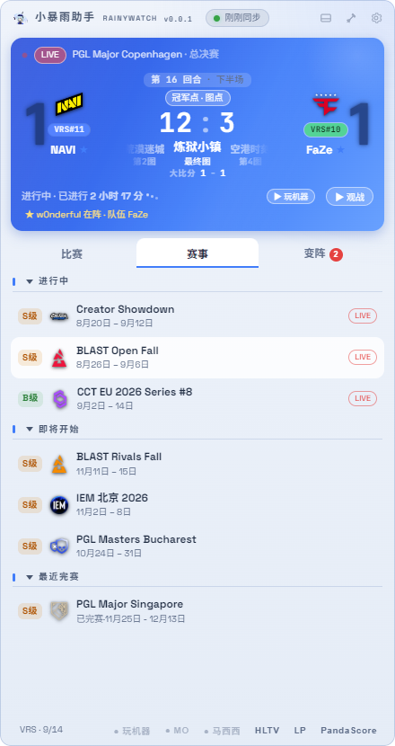<br>
  <sub>蓝色平台主题:赛事评级徽章 · 中文日期区间 · 点击行打开赛事页</sub>
</p>

### 🔄 变阵

选手转会动态:加入 / 离开箭头、**国籍中文显示**(丹麦 / 俄罗斯 / 美国…),行内挂着精确的状态标签——**替补席 / 租借 / 回归首发 / 临时替补 / 教练 / 退役 / 非活跃**等直接可读。**悬停浮现一句话解说**,能从 Liquipedia 的原始条目推断出十余种精确动作:队间转会、自由人加盟、下家待定、**从二队擢升一线队**、**下放二队 / 青训**、转入替补席、租借、临时替补、复出、回归首发、挂编后离队、退役与队内转型……解说口吻可在设置里切换——**专业**(转会 / 替补席)或**诙谐**(板凳梗 / 感谢服役)。**新增变阵带 NEW 徽章并弹系统通知**;选手名旁 ★ 一键设为高光选手,其"当前效力队伍"由 Liquipedia 选手页自动解析(转会后自动/手动重解析)。

<p align="center">
  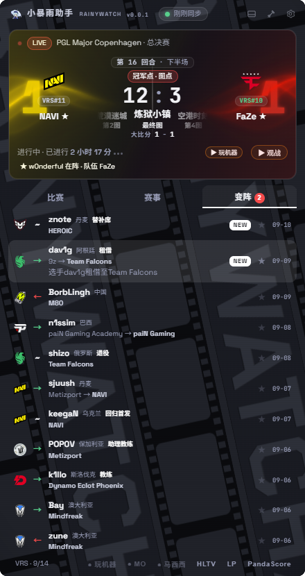<br>
  <sub>队色对撞主题:替补席 / 租借 / 退役 / 回归首发等标签 · 二队擢升与队间转会路径 · 悬停解说(dav1g 租借行) · NEW 徽章 · 国籍中文</sub>
</p>

### 🎨 外观、尺寸与主题

- **7 套主题**:蓝色平台 / 战术沙盘 / 透明 / 队色对撞 / 磷光终端 / 期刊海报 / 印花集,设置面板即点即换;**切换瞬间从点击处圆形扩散过渡**(进出透明主题也一样平滑);深色主题自带氛围动效(可逐项关闭,`prefers-reduced-motion` 下自动停用)
- **对撞波与底片(队色对撞主题)**:主卡两侧有以双方队色流动的 WebGL 光波,无缝循环;鼠标悬停某侧时该侧光效增强,指向哪边哪边亮;列表背后还有**电影底片 × 图带流动的氛围背景(底片动画)**,关闭开关即定格为静态底片,不闪烁不穿帮(动效均可在设置中单独关闭)
- **战队主色体系**:内置上百支战队的品牌主色色板,驱动队色特大比分、队名着色与光效颜色;未收录的队伍按队名哈希取色兜底
- **地图信息显示**:主卡在打图可选**图序带**(前图 · 当前 · 下张)或**只显示当前图**,设置面板即点即生效
- **不透明度** 40%~100% 滑块即时调节;调得过低时自动为文字加投影描边保证可读
- **四档尺寸布局**(极窄 / 小卡 / 标准 / 大窗):信息层级随窗口实际尺寸自动增减,也可直接拖拽边缘自由调整;窗口收窄时标题栏文案(品牌 / 版本 / 同步状态)逐级收纳,不换行不截断;**迷你模式**缩成一条比分胶囊(队名队标同行、比分/倒计时独占中央、队色大比分贴两侧、图序与 BO 数在下缘),双击还原
- **中文字体默认思源黑体**(Noto Sans SC,内嵌切片,任何机器排版一致),设置中可切换 MiSans / 微软雅黑;**字号五档**缩放全应用文字(默认档与设计稿完全一致);拉丁字符按主题走 Chakra Petch / Space Grotesk / Saira 等展示字体
- 界面语言**中文 / English 可切**,英文界面自动换用**国际主播阵容**(ESL / BLAST / PGL 等 Twitch 频道,官方 API 检测开播——需在设置里配置你自己的免费 Twitch 凭证,未配置时不检测也不显示英文主播);**窗口置顶 / 图钉(钉在桌面)/ 鼠标穿透锁定 / 开机自启 / 托盘常驻**一应俱全(标题栏没有 ✕,关闭=收进托盘)

<p>
  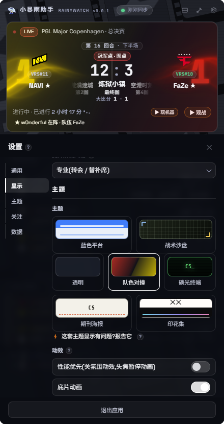<br>
  <sub>设置面板:左侧分区条目(通用 / 显示 / 主题 / 关注 / 数据)直达对应区块,一页滑到底;主题卡即点即换,动效以滑块开关逐项控制(性能优先 / 底片动画…);数据区含 PandaScore / Twitch 免费凭证入口</sub>
</p>
<p>
  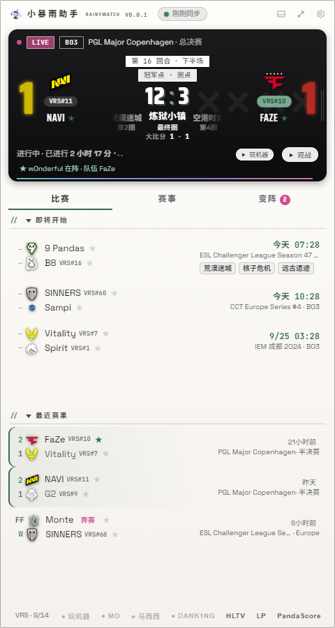<br>
  <sub>大窗尺寸:同屏容纳更多比赛行与更完整的信息层级</sub>
</p>

### 📟 迷你条

窗口缩成一条 240×104 的比分胶囊:**队名队标一行、当前比分/倒计时独占中央**,两侧**队色大比分数字**贴边垫底作景深,左下角显示**图序**、右下角显示 **BO3**(悬停可看回合比分);双击任意处还原完整窗口。迷你条字号恒为固定,保证 240px 里永远排得开。

<p align="center">
  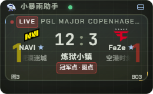<br>
  <sub>迷你模式:一瞥即知,双击还原</sub>
</p>

### 🖼️ 更多主题一览

| 蓝色平台 | 期刊海报 |
| --- | --- |
| 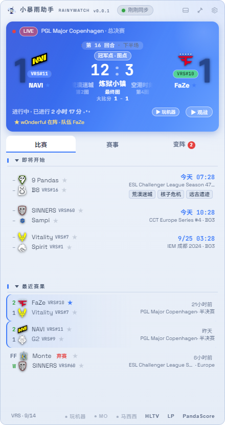 | 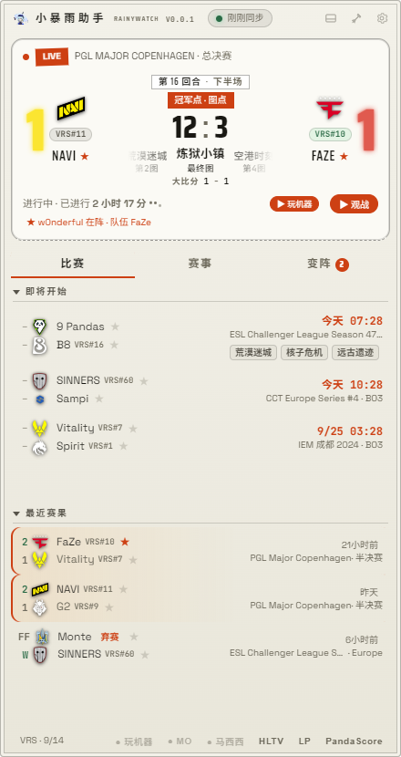 |
| **印花集** | **磷光终端** |
| 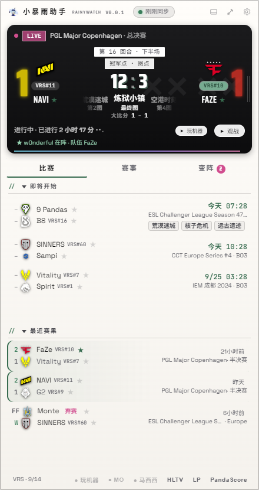 | 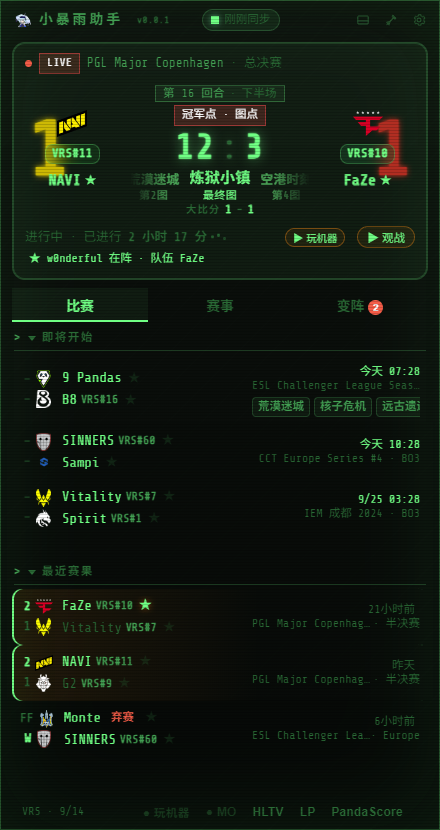 |

### ⚡ 性能与资源占用

RainyWatch 常驻桌面、窗口置顶,带有持续的环境动效,透明窗体由系统合成器逐帧混合——观感来自这些,后台开销也来自这些。参考水位(近年主流多核桌面,空闲、动效全开):任务管理器 CPU 约个位数百分比,GPU 低于 2%,内存约 300–400MB;老机器与核显笔记本会更高。

机器比较吃紧时,可以按需往下调:

- **「性能优先」**(设置 → 主题):一键停用全部氛围动效,窗口失焦时自动暂停动画,空闲占用接近静止
- **动效逐项开关**(设置 → 主题):对撞波(WebGL)、底片动画、队色辉光(悬停)、战术扫光……按主题逐项列出,即点即生效;悬停类动效只在鼠标碰到主卡时触发,平时零开销
- **系统「减少动态效果」**开启时,所有动效自动停用
- 选用以静态排版为主的主题(蓝色平台 / 期刊海报)也能明显降低合成负担
- 数据侧不用担心:Liquipedia 官方 API 合规限速 + ETag 条件请求,手动刷新有 30 秒冷却,不会热轮询

### 🌐 网络与数据

**数据粒度**:应用按你配置的数据源自动取用最高可用粒度,某一层缺数据时自动回落到下一层展示,不会报错或卡死:

| 你配置了什么 | 直播中的比赛能看到 |
| --- | --- |
| 默认(Liquipedia,无需配置) | 赛程、赛果、图序条、VRS 排名、变阵 + 直播状态、阶段标签与已进行时长;**比分通常缺失**(Liquipedia 免费数据对进行中的比赛多无比分) |
| + PandaScore token(免费可得) | 上述全部 + **系列大比分与当前图号/图名**,每 45 秒同步(仅覆盖 PandaScore 收录的正在进行的比赛) |
| + PandaScore 付费档 | 上述全部 + **回合级实时比分**(主卡中央大数字) |

- 数据来自 Liquipedia 官方 API:自定义 User-Agent、请求间隔限速、ETag 条件请求,合规礼貌访问
- **英文主播开播检测走 Twitch 官方 API**(Helix 批量接口,一轮一个请求):你在设置里自配免费 Client ID / Secret;应用**不抓取 Twitch 页面**;未配置凭证时不检测、不显示英文主播。斗鱼 / 虎牙无公开接口,采用房间页内嵌开播状态(每 2 分钟)
- **多开共享限速**:同时开多个实例(或与其它版本同开)时共享限速额度,不容易触发数据源封禁;触发 429 后全实例同步静默冷却,不"边封禁边重试"
- **手动刷新有 30 秒冷却**(题头同步点 = 刷新入口):防连点把请求队列堆满触发限流;冷却期点击会黄点脉冲提示剩余秒数
- **启动先显缓存**:赛事 / 变阵 / 图序 / 排名全部本地缓存,打开即显示上次数据,后台静默更新(赛事/变阵 30 分钟一轮,ETag 无变化不重绘);首次使用无缓存时,对应区块显示"正在同步…"挂起态,而不是误导性的"暂无"
- 自动跟随系统代理;断网或请求失败时黄点提示"数据可能过期"

### 📥 下载与使用

从 [Releases](https://github.com/likeravine233/RainyWatch/releases) 下载,两种包任选(Windows 10 / 11):

- **`RainyWatch-v0.0.1-win-x64.zip`(推荐)**:解压到任意目录,双击 `RainyWatch.exe`——解压一次,此后**每次启动都秒开**。
- **`RainyWatch-Portable.exe`**:单文件便携版,双击即用;便携形态每次启动都要自解压(约十秒),介意等待请选 zip。

首次启动几秒后出数据。

> **认准官方渠道**:唯一官方下载渠道是本仓库 [Releases](https://github.com/likeravine233/RainyWatch/releases) 页;任何下载站、网盘、聊天群里的"RainyWatch"安装包均与本项目无关,请勿使用。每个版本附带 `SHA256SUMS.txt`(逐资产校验),`certutil -hashfile <文件名> SHA256` 比对一致才是官方原版。本应用不内置任何密钥:全部凭证由你自己申请、只存在你电脑上,网络访问仅限下方列出的数据源。

**更新是自动感知的**:应用启动后与每 12 小时会向 GitHub 查询一次最新 Release;发现新版本时,题头亮起「发现新版本」角标(点击直达 Release 页),并在启动时弹一次系统提示——每个版本最多提醒一次,之后不再打扰。也可以随时在设置面板底部点「检查更新」手动查。点「一键更新」会自动按当前形态拉取新包并校验替换,你的设置与凭证都保留在本机不受影响。

也可以从源码运行:

```bash
npm install
npm start        # 开发模式
npm run dist     # 打包 → dist-release/:Portable.exe + win-x64.zip + SHA256SUMS.txt
```

> "开机自启"仅打包版有效;开发模式(`npm start`)注册的是 electron.exe,无实际意义。

### 🚀 快速开始(可选增强)

应用**开箱即用**:比赛、赛事、变阵、VRS 数据来自 Liquipedia 公开接口,无需注册任何账号。以下增强项全部**免费**,凭证由你自行申请、仅保存在本机(点标题栏右上角 ⚙ 打开设置,左侧分区条目直达「数据」):

| 增强项 | 获取方式(全免费) | 解锁内容 |
| --- | --- | --- |
| PandaScore Token | [pandascore.co](https://pandascore.co) 注册(有免费档)→ 控制台生成 API Token → 粘贴到 设置 → 数据 | 直播中比赛的大比分与图号/图名,45 秒同步 |
| Twitch Client ID / Secret | [dev.twitch.tv/console](https://dev.twitch.tv/console) 用普通 Twitch 账号登录(需先完成邮箱验证并开启两步验证 2FA)→ Register Your Application(名字随意,类别选 Application,回调填 `http://localhost`)→ 复制 Client ID 并生成 Secret → 粘贴到 设置 → 数据 | 英文主播(ESL/BLAST/PGL 等)的开播绿点;未配置时不检测英文主播,也不访问 Twitch |

> 本软件完全免费、无广告、无任何商业行为;所有凭证仅存储在你自己的设备上,不经由任何第三方服务器中转。

### ⌨️ 操作速查

| 操作 | 方式 |
| --- | --- |
| 打开设置 | 标题栏右上角 ⚙;面板左侧分区条目可直达对应区块 |
| 检查更新 | 设置面板底部「检查更新」;发现新版时题头角标直达 Release |
| 拖动窗口 | 按住标题栏 / 迷你模式按住任意空白处 |
| 调整大小 | 拖拽窗口边缘(布局随尺寸自动分级);或设置面板"尺寸预设"四档 |
| 打开详情 | 点击比赛行 / 赛事行 / 变阵行 / 队伍 logo(系统浏览器打开) |
| 复制比分 | 点击主卡中央比分 |
| 手动刷新 | 点击题头同步点(30 秒冷却) |
| 关注队伍 / 选手 | 列表队伍名旁 ★、变阵选手旁 ★、或设置面板搜索添加 |
| 观战 | 直播卡右下 "▶ 观战" / "▶ 玩机器";最近赛果行内 "回放" |
| 迷你模式 | 标题栏 ▢ 进入,双击主卡退出 |
| 图钉 / 置顶 | 标题栏 📌 / 托盘菜单(两者互斥) |
| 隐藏 / 唤出 | 托盘图标单击 |
| 退出 | 托盘菜单"退出"或设置面板底部"退出应用" |

### ❓ 常见问题

| 问题 | 说明 |
| --- | --- |
| 比分更新有多快? | 赛程与大比分来自 Liquipedia,分钟级;回合级实时比分需配置 PandaScore token(免费档可得,但**回合级数据为付费档**,免费档自动回退为大比分展示),且仅覆盖其收录的正在进行的比赛 |
| 为什么有的比赛没有图序条? | 该场 Liquipedia 未记录 BP 过程;若整场未被 Liquipedia 收录,则不会出现在列表中 |
| 刚打开时为什么显示"正在同步…"? | 首次使用还没有本地缓存;等首抓完成即显示。之后启动会先显缓存数据,后台再静默更新 |
| 高光选手的队伍不对? | "当前队伍"来自其 Liquipedia 选手页,刚转会的选手可能滞后数小时;重启应用会自动重新解析。置顶匹配已兼容 PandaScore 与 Liquipedia 的队名差异 |
| 变阵的标签和解说怎么来的? | 由每条 Liquipedia 转会条目(备注 / 去向 / 队伍关系)在本地推断:转入替补席、租借、擢升一线队、下放二队等十余种动作各有一句话解说,行内标签可直接读;国籍在中文界面显示中文 |
| 英文主播条目不见了? | 英文界面且未配置 Twitch 凭证时不显示英文主播(也不会访问 Twitch):按 设置 → 数据 的问号提示免费申请 Client ID / Secret 并粘贴,绿点即恢复 |
| 怎么知道有新版本? | 题头「发现新版本」角标 + 每版本一次的启动提示;设置面板底部「检查更新」随时手动查;新版 exe 覆盖旧版即完成更新(设置与凭证保留) |
| 想反馈问题? | 设置面板底部"反馈与支持"直达 [Issues](https://github.com/likeravine233/RainyWatch/issues),版本与系统环境会自动附上;数据 / 功能 / 界面主题三套模板均提供中英双语 |

### 🙏 数据来源与致谢

- [Liquipedia](https://liquipedia.net/counterstrike):赛程、赛事、变阵、VRS 排名与部分队标(文字与数据以 CC BY-SA 3.0 提供;本应用通过其官方 API 访问)
- [PandaScore](https://pandascore.co):可选的比分增强数据(用户自备 token,仅本地展示;应用页脚按其服务条款常驻 "Source: PandaScore" 署名)
- 队标图片来自 Liquipedia 页面与 PandaScore 接口返回的图片地址;玩机器Machine 直播间入口指向其斗鱼直播间(房间 6657)
- **免责声明**:本项目为独立个人开发作品,**不隶属于任何组织或公司**——与 Valve、HLTV、Liquipedia、PandaScore、Twitch、斗鱼、虎牙及任何赛事主办方均无关联;文中出现的第三方名称与商标仅用于说明数据来源,权利归其各自所有者。软件完全免费、**无广告、无内购、无任何商业行为**;完整功能所需的全部凭证(PandaScore Token、Twitch Client ID / Secret)均可由用户**自行免费申请**,仅存储于用户本机。数据准确性以各官方来源为准

<div align="center">

<br>

> **桌面的一角,赛况的一瞥。愿每一场加时,都不负你熬过的灯。**
> 祝你永远不死永远爽！

### ☕ 支持开发者

> 如果想支持作者,欢迎您给我点个 ⭐ Star,鼓励我继续更新维护!如果您愿意,也非常欢迎您通过以下渠道捐赠:

<p align="center">
  &nbsp;&nbsp;&nbsp;&nbsp;&nbsp;&nbsp;
  
</p>
<p align="center"><sub>微信赞赏码 · 支付宝收款码</sub></p>

> 感谢您的支持与认可,祝您好运天天,连胜常青!

站点:[RainyWatch 主页](https://likeravine233.github.io/RainyWatch/) · 反馈:[Issues](https://github.com/likeravine233/RainyWatch/issues) · [English](#-english)

</div>

---

---

## 🇬🇧 English

### What is this?

RainyWatch is a compact CS2 widget that lives in a corner of your Windows desktop: who is playing right now, the live score, when the next match starts, recent results and roster moves — all glanceable, no alt-tabbing. It ships as a single portable executable, no installation needed. Everything in this section shows the **English UI**; the app is equally fluent in Chinese (see the 简体中文 section above).

### 🕹️ Hero card · live matches

The live match takes over the hero card, laid out like a broadcast HUD:

- The **central number is the current-map round score** (e.g. 12:9), with the **map veto strip** below it (Map 1 Ancient → Map 2 Mirage → Final map Inferno, current map highlighted) and the series score (1 - 0); **oversized team-colored series digits** sit in the background outside both logos (near card height, glowing in the team color) so the lead reads at a glance; phase chips (**pistol round / upcoming side swap / map point / overtime / match point / decider**) are all derived from format + round count (MR12)
- Round changes flash; the **"in progress · elapsed" line ticks live on its own row**, followed by the **follow note (★ w0nderful playing · Team FaZe)** on a separate line — they never squeeze or truncate each other; **click the score to copy** it
- **Watch shortcuts follow your UI language**: "▶ Watch" always opens the official stream, and a second button jumps to the first English-language channel that is currently live — the international line-up covers the official Twitch channels of **ESL CS, BLAST Premier and PGL** plus popular community streamers (**ohnepixel, fl0m**), each with a live presence check via Twitch's official API (bring your own free credentials in Settings → Data; without them EN streamers are not checked at all — see [Quick start](#-quick-start-optional-boosts)). The status bar at the bottom keeps one-click links for the whole line-up, plus HLTV and Liquipedia. The Chinese UI swaps this line-up for Chinese casters on Douyu/Huya
- Rescheduled matches are flagged as **"delayed / moved up by xx min"**
- Falls back to series score when no round-level data is available; the strip can be switched to **current map only** (Settings → Map info display)

<p align="center">
  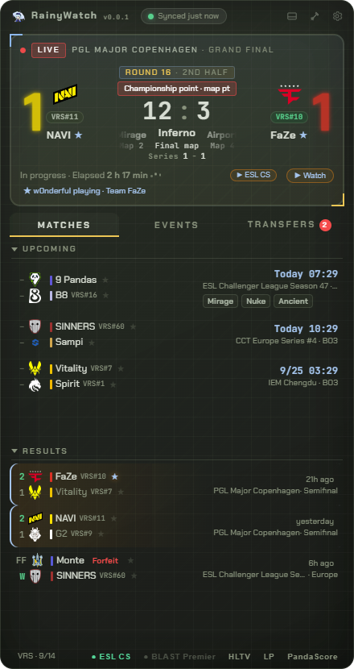<br>
  <sub>Tactical theme: central round score · veto strip · team-colored background digits · VRS badge</sub>
</p>

### 📋 Match list

- **Upcoming** matches with timezone-aware times (system zone by default, DST handled automatically) and countdowns when a match is within the hour; **recent results** color-coded with replay links and "ended N h ago" notes
- **Forfeit display**: forfeited series show the source's own **FF / W** score plates (W = the side advancing without playing), with a small "forfeit" tag next to the forfeiting team's name; times render as usual
- **Map veto strip**: for series whose BP was recorded by Liquipedia, the full map sequence is shown inline
- **V# badges**: Valve world ranking (top 200) next to team names, higher-ranked side highlighted in green. The ranking is the **VRS (Valve Regional Standings)**: published by Valve roughly monthly (more frequently near Major qualifiers) and never including ongoing matches; the app follows Liquipedia's mirror — typically a few hours to a day behind the official release — re-checks every 6 h, and shows the stamp date in the footer
- **Tournament tier badges** (S / A / B / C)
- **★ Follow teams & star players**: star any team from a match row or any player from a transfer row (or search them in settings); starred matches are **highlighted and pinned to the top** — hover the row and it unfolds one extra line revealing the follow note ("★ Team FaZe · ropz playing"); pre-match reminders (5/10/15/30 min) and final-score notifications; PandaScore vs Liquipedia naming differences (full name vs acronym) are matched automatically, so NAVI-style short names never miss a pin
- Collapsible list sections for small windows

<p align="center">
  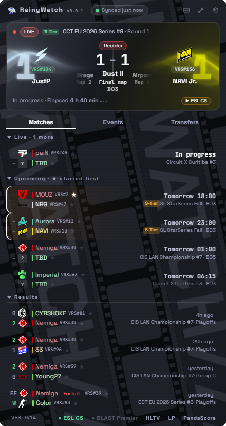<br>
  <sub>Versus theme · live-data screenshot: forfeit row FF / W with "forfeit" tag · upcoming countdowns and "ended N h ago" notes · V# badges</sub>
</p>

### 🏆 Events & transfers

- **Events**: ongoing / upcoming tournaments with tier badges and localized date ranges; event names in short / full / community-translation modes
- **Transfers**: roster moves with join/leave arrows, nationalities, and precise inline tags — **benched / loan / back from bench / stand-in / coach / retired / inactive**. **Hover a transfer for a one-line story** that reads the fine print out of Liquipedia's raw entries: plain transfers, free-agent signings, next-stop-TBD exits, **academy promotions to the main roster**, **demotions to the academy squad**, bench moves, loans, stand-in stints, comebacks, leaves-while-inactive, retirements and in-team role switches… Story tone is pickable in settings — **professional** (transfers / bench) or **playful** (bench memes / thank-you-for-service). New moves get a **NEW badge** plus a system notification; ★ to star players as highlighted — their current team is auto-resolved from Liquipedia

<p>
  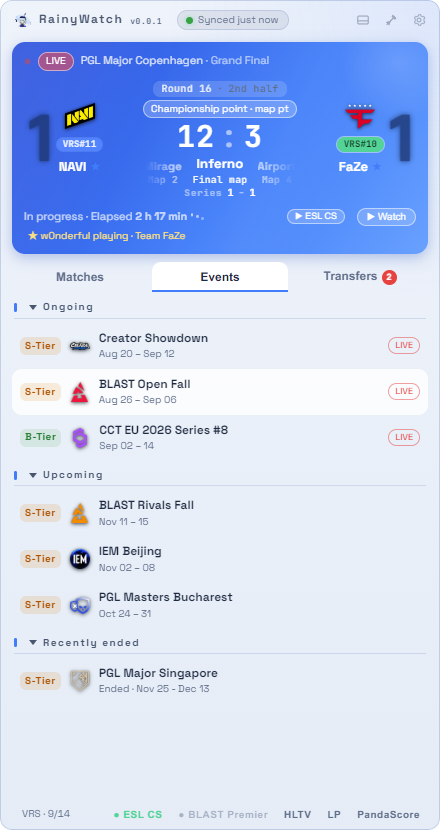<br>
  <sub>Events: tier badges and localized date ranges</sub>
</p>
<p>
  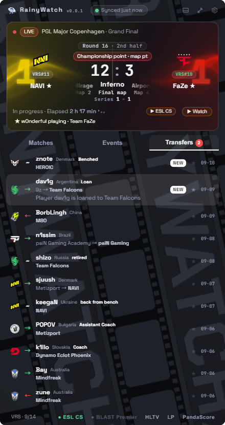<br>
  <sub>Versus theme: benched / loan / retired / back-from-bench tags · academy promotion and inter-team moves · hover story on the loaned row · NEW badges</sub>
</p>

### 🎨 Themes, sizes & settings

- **7 themes**: Blue Platform / Tactical / Clear / Versus / Phosphor CRT / Journal Poster / Printstream — switchable in settings; **switching ripples outward from your click in a circular reveal** (to and from the transparent Clear theme alike); dark themes carry ambient motion (individually switchable in settings; disabled under `prefers-reduced-motion`)
- **Clash wave & film strip (Versus theme)**: WebGL light waves flow on both sides of the hero card in each team's color, looping seamlessly; hovering one side boosts that side's glow. Behind the list, a **film-strip × image-tape ambience (film strip animation)** keeps drifting — toggle it off and it freezes into a still backdrop, no flicker, no leftovers (every effect can be toggled off individually in settings)
- **Team color system**: curated brand colors for 100+ organizations drive the oversized score digits, name tinting and wave colors; unlisted teams fall back to a name-hash color
- **Map info display**: show the veto strip (prev · current · next) or the current map only on the hero card
- **40–100% opacity** with automatic text outlining at low opacity
- **Four size presets** (extra-narrow / small / standard / large) with adaptive layout — or just drag the window edge; as the window narrows the titlebar tucks its branding / version / sync text away step by step, never wrapping or truncating; **mini mode** collapses to a single score capsule (team names beside logos, score/countdown centered, team-colored series digits along both edges, map number & best-of at the bottom edge), double-click to restore
- **Chinese text defaults to embedded Noto Sans SC** slices (identical layout on every machine), with MiSans / Microsoft YaHei selectable in settings; **5-step font scaling** applies app-wide (the default step matches the designed look); Latin display fonts vary per theme (Chakra Petch, Space Grotesk, Saira…)
- **English / Chinese UI toggle** — switch any time, every string re-renders instantly; the English UI swaps the caster shortcuts for the international Twitch line-up (ESL CS / BLAST Premier / PGL / ohnepixel / fl0m, live presence check via the official API — needs your own free Twitch credentials in Settings → Data); always-on-top / desktop-pin / click-through lock / autostart / tray (no ✕ button — closing hides to tray)

<p>
  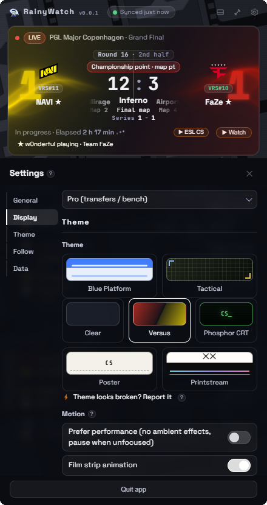<br>
  <sub>Settings: a section rail (General / Display / Theme / Follow / Data) beside one continuous scroll; themes apply on click, ambient effects sit on per-item toggle switches (performance-first / film strip…); the Data section holds the free PandaScore / Twitch credential fields</sub>
</p>
<p>
  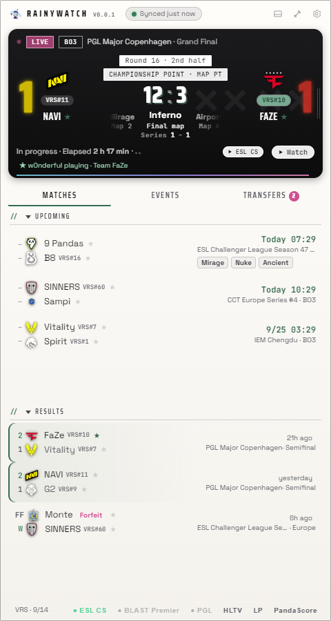<br>
  <sub>Large size: more match rows and richer info levels on screen</sub>
</p>

### 🖼️ More themes

| Blue Platform | Journal Poster |
| --- | --- |
| 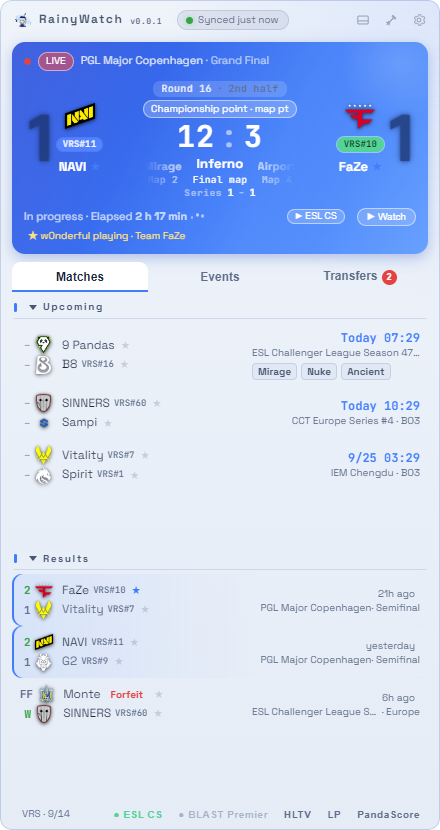 | 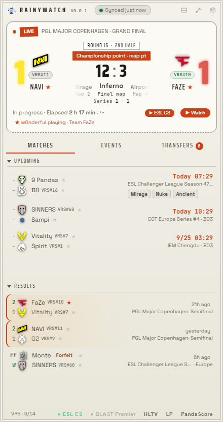 |
| **Printstream** | **Phosphor CRT** |
| 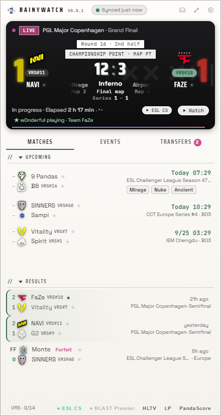 | 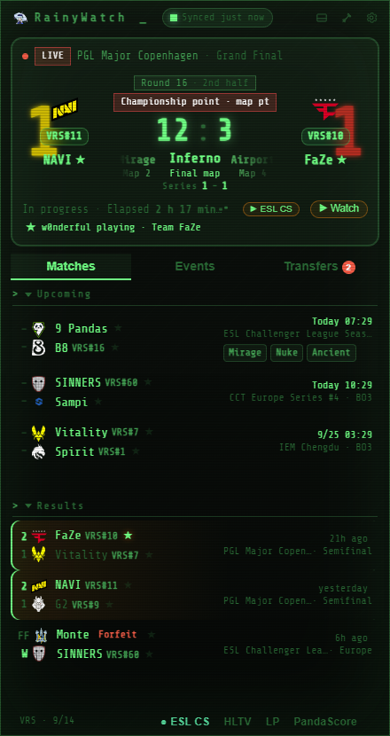 |

### ⚡ Performance

RainyWatch lives on your desktop: always on top, always animated, with a transparent window your OS compositor blends every frame — that is where both the look and the background cost come from. On a recent multi-core desktop, idle with all effects on, expect single-digit CPU in Task Manager, under 2% GPU and roughly 300–400 MB of RAM; older machines and integrated-graphics laptops will see more.

If your machine is tight on resources, dial it down:

- **Performance-first toggle** (Settings → Theme): disables all ambient effects at once and pauses animations while the window is unfocused — idle cost drops to near zero
- **Per-effect switches** (Settings → Theme): clash wave (WebGL), film strip animation, team auras (hover), tactical sweep… listed per theme and applied instantly; hover effects only trigger while your cursor is on the card, costing nothing at rest
- Windows' **"reduce motion"** accessibility setting disables all effects automatically
- Choosing a mostly-static theme (Blue Platform / Journal Poster) also cuts compositing work
- Data traffic is polite by design: the Liquipedia official API with rate limiting and ETag conditional requests, plus a 30 s cooldown on manual refresh — no hot polling

### 🌐 Networking & data

**Data granularity**: the app always shows the finest granularity your configured sources allow and falls back automatically to the next layer when data is missing — no errors, no dead ends:

| What you configured | What a live match shows |
| --- | --- |
| Default (Liquipedia, no setup) | schedule, results, veto strips, VRS rankings, transfers + live status, phase chips and elapsed time; **the score is often missing** (Liquipedia's free data rarely carries live scores) |
| + PandaScore token (free tier) | all of the above + **series score and current map number/name**, synced every 45 s (only for ongoing matches PandaScore covers) |
| + PandaScore paid tier | all of the above + **round-level score** (the big central digits) |

- Liquipedia official API with polite access: custom User-Agent, rate limiting, ETag conditional requests
- **English streamer live checks use Twitch's official API** (Helix, one batched request per cycle): you bring your own free Client ID / Secret in Settings → Data; the app **never scrapes Twitch pages**; with no credentials configured, EN streamers are not checked or shown. Douyu / Huya have no public API — the app reads each room page's embedded live status (every 2 min)
- **Rate-limit budget shared across instances**; after a 429 all instances cool down together instead of retrying into the ban
- **Manual refresh has a 30 s cooldown** (the header sync dot is the refresh entry) to prevent click-storms from stacking requests
- **Cache-first startup**: events / transfers / map sequences / rankings are cached locally and shown instantly; sections without any cache show a "syncing…" placeholder instead of a misleading "no data" (events/transfers re-poll every 30 min; unchanged content never re-renders)
- System-proxy aware; yellow dot warns when data may be stale

### 📥 Download & run

Grab either package from [Releases](https://github.com/likeravine233/RainyWatch/releases) (Windows 10 / 11):

- **`RainyWatch-v0.0.1-win-x64.zip` (recommended)**: extract anywhere and double-click `RainyWatch.exe` — extract once, and every launch afterwards is instant.
- **`RainyWatch-Portable.exe`**: single file, double-click to run; the portable form re-extracts itself on every launch (~10 s), so pick the zip if that bothers you.

First data appears seconds after launch.

> **Official source only**: the one and only download channel is this repository's [Releases](https://github.com/likeravine233/RainyWatch/releases) page — installers from download sites, cloud drives or chat groups are **not** this project. Every release ships a `SHA256SUMS.txt` (per-asset); a matching `certutil -hashfile <file> SHA256` means it's the genuine build. The app embeds no secrets: all credentials are user-supplied, stored locally only, and network access goes only to the data sources listed below.

**Updates are sensed automatically**: at launch and every 12 hours the app queries GitHub for the latest release. When one is found, an "update available" badge lights up in the titlebar (click it to open the release page) and a one-time system dialog appears — each version nags at most once. You can also hit "Check for updates" at the bottom of the settings panel any time. "One-click update" pulls the package matching your current form, verifies and replaces it automatically; your settings and credentials stay on your machine.

Or run from source:

```bash
npm install
npm start        # dev mode
npm run dist     # build → dist-release/: Portable.exe + win-x64.zip + SHA256SUMS.txt
```

### 🚀 Quick start (optional boosts)

The app **works out of the box**: matches, tournaments, transfers and VRS come from Liquipedia's public API — no account needed. The optional boosts below are all **free**; you obtain the credentials yourself and they never leave your machine (open settings via the ⚙ button at the top-right of the titlebar — the rail inside jumps straight to **Data**):

| Boost | How to get it (all free) | Unlocks |
| --- | --- | --- |
| PandaScore Token | Sign up at [pandascore.co](https://pandascore.co) (free tier works) → generate an API token in the dashboard → paste in Settings → Data | Series score & map number/name of live matches, synced every 45 s |
| Twitch Client ID / Secret | Log in at [dev.twitch.tv/console](https://dev.twitch.tv/console) with a regular Twitch account (verify your email and enable two-factor authentication 2FA first) → Register Your Application (any name, category Application, redirect `http://localhost`) → copy the Client ID, generate a Secret → paste in Settings → Data | Live dots for English streams (ESL/BLAST/PGL etc.); without them EN streamers are not checked and Twitch is never contacted |

> This software is completely free — **no ads, no in-app purchases, no commercial activity of any kind**; all credentials are stored on your own device only and never pass through any third-party server.

### ⌨️ Quick reference

| Action | How |
| --- | --- |
| Open settings | the ⚙ button at the top-right of the titlebar; the section rail inside jumps straight to each block |
| Check for updates | "Check for updates" at the bottom of settings; the titlebar badge opens the release page when one is out |
| Move / resize | drag the titlebar (anywhere in mini mode); drag a window edge, or pick a size preset in settings |
| Details | click a match / event / transfer row or a team logo (opens in your browser) |
| Copy score | click the central score on the hero card |
| Manual refresh | click the header sync dot (30 s cooldown) |
| Follow teams / players | ★ next to team names, ★ next to players in transfers, or search in settings |
| Watch | "▶ Watch" / caster buttons on the live card; "replay" on result rows |
| Mini mode | the ▢ button in the titlebar; double-click the card to restore |
| Pin / always on top | 📌 in the titlebar / tray menu (mutually exclusive) |
| Hide / restore | single-click the tray icon |
| Quit | tray menu "Quit" or "Quit app" at the bottom of settings |

### ❓ FAQ

| Question | Answer |
| --- | --- |
| How fresh are the scores? | Schedule and series scores come from Liquipedia (minute-level); round-level live scores need a PandaScore token and only cover matches PandaScore tracks |
| Why no veto strip on some matches? | Liquipedia has no recorded BP for that series; series it does not cover at all never appear in the list |
| Why "syncing…" on first launch? | There is no local cache yet; the first fetch fills it. Later launches show cached data instantly and refresh in the background |
| The EN streamer entries are gone? | Without Twitch credentials configured, EN streamers are neither checked nor shown (Twitch is never contacted): follow the ? hint in Settings → Data to get free credentials and paste them in |
| Where do transfer tags & stories come from? | Inferred locally from each Liquipedia entry (notes, destination, team relationships): a dozen-plus precise moves — benched, loaned, academy promotion, demotion to the academy squad… each with a one-line story; tags are readable right on the row |
| How do I know there is an update? | A titlebar badge plus a once-per-version dialog; "Check for updates" in settings works any time. Overwriting the old exe with the new one keeps your settings |
| Found a problem? | "Feedback" at the bottom of settings opens GitHub Issues with version and environment pre-filled; the data / feature / UI-theme templates are bilingual |

### 🙏 Data sources & credits

- [Liquipedia](https://liquipedia.net/counterstrike) — schedule, tournaments, transfers, VRS standings and some team logos (CC BY-SA 3.0; accessed via the official API)
- [PandaScore](https://pandascore.co) — optional score enhancement (bring your own token, displayed locally only; the footer permanently shows the "Source: PandaScore" attribution required by its terms)
- Team logos load from Liquipedia pages and the image URLs returned by PandaScore
- **Disclaimer**: this is an independently developed personal project, **not affiliated with any organization or company** — Valve, HLTV, Liquipedia, PandaScore, Twitch, Douyu, Huya and any tournament organizer are uninvolved; third-party names and trademarks mentioned here only identify data sources and belong to their respective owners. The software is completely free, with **no ads, no in-app purchases and no commercial activity**; every credential needed for full functionality (PandaScore token, Twitch Client ID / Secret) can be **obtained free of charge by each user** and is stored locally only. Data accuracy is subject to the official sources

<div align="center">

<br>

> **A quiet corner for loud games — may every overtime be worth the midnight oil.**
> Never die, always ballin'!

### ☕ Support the developer

> If you'd like to support the author, giving this project a ⭐ star is the best encouragement to keep development going! And if you feel like it, donations through the channels below are warmly welcome, too:

<p align="center">
  &nbsp;&nbsp;&nbsp;&nbsp;&nbsp;&nbsp;
  
</p>
<p align="center"><sub>WeChat tip QR · Alipay QR</sub></p>

> Thank you for your support and kindness — may good luck be with you every day, and may your win streak stay evergreen!

Site: [project homepage](https://likeravine233.github.io/RainyWatch/) · Feedback: [Issues](https://github.com/likeravine233/RainyWatch/issues) · [简体中文](#-%E7%AE%80%E4%BD%93%E4%B8%AD%E6%96%87)

</div>

---

## 📄 许可 / License

[AGPL-3.0](LICENSE) · 字体与第三方素材说明见 [THIRD-PARTY-NOTICES.md](THIRD-PARTY-NOTICES.md) — fonts & third-party assets

> **声明 / Notice**:角色立绘(shuiyue*.png)描绘《明日方舟》(Arknights)角色「水月」(Mizuki),该角色形象版权归鹰角网络(Hypergryph)所有;立绘为本项目作者自制,不适用 AGPL-3.0,作者保留所有权利,未经授权不得单独提取或商用。本项目为非官方个人作品,免费开源,与鹰角网络及任何相关实体无隶属关系。
>
> **Notice**: The character artwork (shuiyue*.png) depicts Mizuki from *Arknights*, whose character likeness is owned by Hypergryph. The artwork itself was created by the project author, is not licensed under AGPL-3.0, and may not be extracted or commercially used without permission. This project is an unofficial personal work — free and open source, unaffiliated with and not endorsed by Hypergryph or any related entity.

> 💬 本项目是作者的 vibe coding 之作——代码质量请勿过度计较;欢迎各路大牛批评指正、提 PR 一起优化,项目正在活跃维护中,反馈请开 [Issues](https://github.com/likeravine233/RainyWatch/issues)。
>
> This project is the author's vibe-coding work — please go easy on the code quality. Critiques, reviews and PRs from seasoned developers are more than welcome; the project is under active maintenance, and feedback via [Issues](https://github.com/likeravine233/RainyWatch/issues) is always appreciated.
